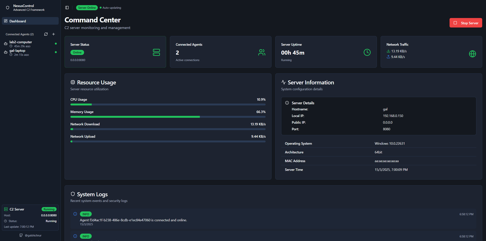

# NexusControl

NexusControl is Remote Command & Control (C2) system developed in Python, designed for Red Team and penetration testing.  
It provides a secure way to manage and monitor remote machines (agents) through an encrypted TCP connection, controlled entirely from a local management server with a web interface.

All communication between the server and connected agents is end-to-end encrypted using modern cryptographic mechanisms - ECDH (Curve25519) for key exchange and AES-GCM for symmetric encryption.  
This ensures confidentiality, integrity, and authentication for every transmitted message.

NexusControl was built to demonstrate secure communication, agent management, and control protocols within cybersecurity testing frameworks.  
It is an advanced learning and demonstration project - not intended for malicious or unauthorized use.



---

## Disclaimer
This project was created for educational, ethical hacking, and research purposes only.
Use it only in controlled environments with explicit permission.
The author is not responsible for any misuse or damage caused by the software.

## Installation

### 1. Clone the Repository
```bash
git clone https://github.com/galshichrur/nexuscontrol.git
cd nexuscontrol
```

### 2. Install Server Dependencies
```bash
cd app
pip install -r requirements.txt
```

### 3. Configure Environment
Edit the .env file in /app to set your server and API configuration.

### 4. Build the Frontend
```bash
cd frontend
npm install
npm run build
```

## Running the Project

### Start the API and TCP Server
```bash
cd app
py main.py
```
The API and server will start automatically.

You can access the web dashboard at:
http://127.0.0.1:8000


### Build and Run an Agent
Update settings in agent/main.py to match server address.
```bash
cd agent
pip install -r requirements.txt
pyinstaller --noconsole --optimize 2 --onefile --name agent main.py
```
After building, the executable will appear in:
```
agent/dist/agent.exe
```
Run this file on a test machine, it will securely connect to the NexusControl server.
