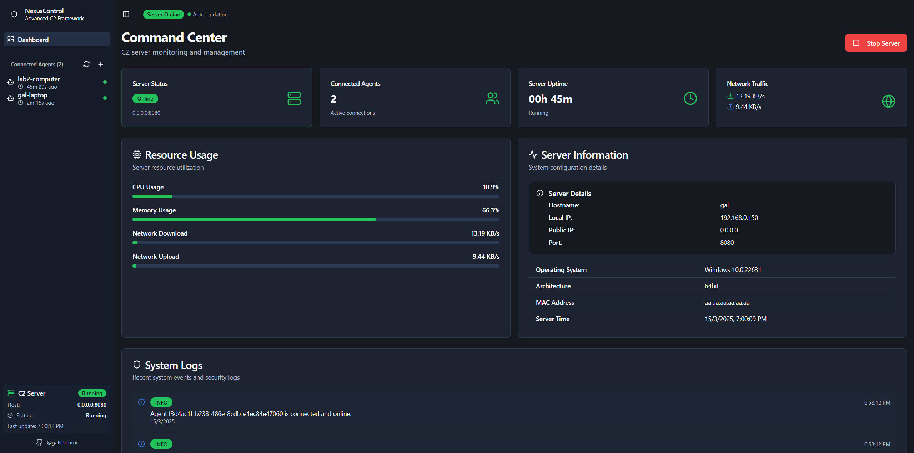

# NexusControl
[View Documentation in Hebrew (PDF)](NexusControl.pdf)

Remote Command & Control (C2) system developed in Python, designed for Red Team and penetration testing.
It provides a secure way to manage and monitor remote machines through an encrypted TCP connection using custom JSON protocol, controlled entirely from a management server with a web interface.
Remote computers connect from compiled executable (PE) with startup persistence, evasion, and obfuscation techniques to maintain undetected access.
All communication between the server and connected agents is encrypted using ECDH (Curve25519) for key exchange and AES-GCM for symmetric encryption to protect data
confidentiality and integrity.

This project was created for educational purposes only.



---

## Installation

You can host the server in your local computer or at a remote server easily.

### 1. Clone the Repository
```bash
git clone https://github.com/galshichrur/nexuscontrol.git
cd nexuscontrol
```

### 2. Build the Frontend
```bash
cd frontend
npm install
npm run build
```

### 3. Install Server Dependencies
```bash
cd ../app
python -m venv .venv
```
In Windows:
```bash
.venv\Scripts\activate
```
In Linux:
```bash
source .venv/bin/activate
```

Install requirements.txt
```bash
pip install -r requirements.txt
```

### 3. Configure Environment
Edit the .env file in /app to set your TCP server and API configuration.

In Windows:
```
move .env.global .env
```
In Linux:
```
mv .env.global .env
```

## Running the Project

### Start the API and TCP Server
```bash
py main.py
```
The API and TCP server will start automatically.

You can access the web dashboard at:
http://127.0.0.1:8000


### Build agent PE
Update settings in agent/main.py to match server address.
```bash
cd ../agent
python -m venv .venv
.venv\Scripts\activate
pip install -r requirements.txt
pyinstaller --noconsole --optimize 2 --onefile --name agent main.py
```
After building, the executable will appear in:
```
agent/dist/agent.exe
```
Run this file on a test machine, it will securely connect to the NexusControl server.
